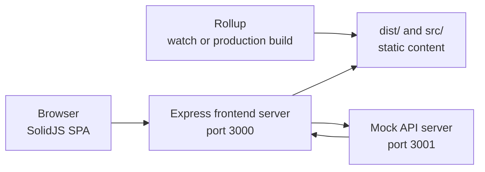
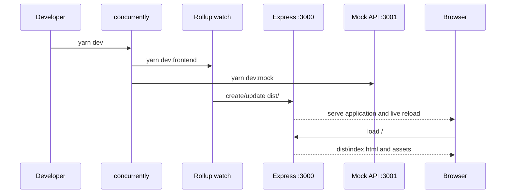
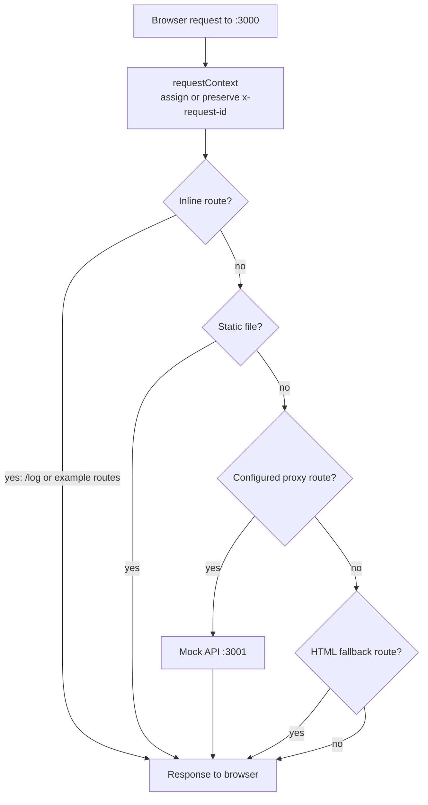
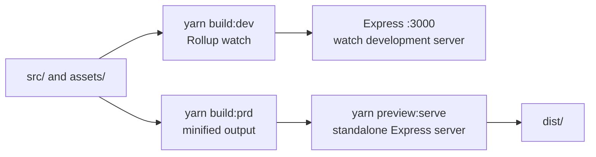

# Architecture

Solid Calculator is a small client-rendered application with two Node.js
servers during development:

- The frontend server runs on port 3000. It serves the Rollup output, supports
  client-side routes, proxies selected requests, and hosts the inline example
  middleware.
- The mock API runs on port 3001. It provides the development-only `/api/config`
  and `/api/status` endpoints.

The production build is static. The standalone Express server can serve the
generated `dist/` directory, but this repository does not contain a production
database or a production API implementation.

Local server ports and hosts can be changed through `.env`; see
`.env.example`. The defaults are frontend `127.0.0.1:3000` and mock API
`127.0.0.1:3001`.

## System overview



## Directory responsibilities

| Area                                      | Responsibility                                                                                      |
| ----------------------------------------- | --------------------------------------------------------------------------------------------------- |
| `src/`                                    | SolidJS application, routes, calculator state, keyboard handling, and styling                       |
| `rollup.config.base.mjs`                  | Shared TypeScript, Babel, ESLint, PostCSS, asset, HTML, and source-map pipeline                     |
| `rollup.config.dev.mjs`                   | Watch build, development Express server, and live reload                                            |
| `rollup.config.prd.mjs`                   | Clean, minified production build without source maps                                                |
| `scripts/clean.mjs`                       | Removes generated artifacts, with optional dependency cleanup via `--fresh`                         |
| `plugins/rollup-plugin-express-serve.mjs` | Reusable Express server, static files, proxying, SPA fallback, tracing, and middleware registration |
| `plugins/express-serve.mjs`               | Standalone CLI for serving an existing build                                                        |
| `plugins/proxy-path.mjs`                  | Route matching and proxy path rewriting                                                             |
| `plugins/request-context.mjs`             | Request IDs, response headers, and request-scoped loggers                                           |
| `plugins/express-serve-logger.mjs`        | Shared Winston/fallback logger, log levels, context metadata, and file output                       |
| `mock-server/`                            | Development-only API server and route modules                                                       |
| `plugins/example-mocking-plugin.mjs`      | Inline frontend-server mock routes, including the `/log` endpoint                                   |
| `express-serve.config.mjs`                | Local port, static roots, SPA routes, proxy routes, and middleware configuration                    |

## Development startup

`yarn dev` uses `concurrently` to start the frontend watch process and
the mock API process. Rollup rebuilds the browser bundle into `dist/`; the
Express plugin serves that output and `src/`, while livereload refreshes the
browser after a build.



## Browser request flow

The frontend talks only to port 3000. The development server decides whether a
request is handled locally, served as a static file, or sent to the mock API.



The configured routes are:

| Browser path       | Handler                   | Target behavior                                   |
| ------------------ | ------------------------- | ------------------------------------------------- |
| `GET/POST /config` | Frontend proxy            | Rewritten to `GET/POST /api/config` on port 3001  |
| `GET/POST /api/*`  | Frontend proxy            | Forwarded to the same path on port 3001           |
| `POST /log`        | Inline example middleware | Logged by the development process; no persistence |
| `/about`           | SPA fallback              | Serves the built application entry point          |

Proxy matching respects route boundaries, chooses the most specific configured
route, preserves query strings, and forwards the request ID through the proxy.
Use `stripPrefix` for generic prefix removal or `rewrite` for an explicit
target path.

## Request IDs and logging

Both servers install `requestContext()` before their other middleware. It:

1. Reuses an incoming `x-request-id`, or generates a time-sortable, hyphenated ULID.
2. Adds the ID to the response headers.
3. Exposes the ID as `req.requestId`.
4. Exposes `req.log`, a logger that automatically includes the request ID as
   metadata.

The frontend proxy forwards the same ID to the mock API using `x-request-id`.
Morgan trace output includes the ID and proxy target, making one browser request
traceable across both servers.

The shared logger prefers Winston when it is available and otherwise uses the
fallback logger. Console output may contain terminal colors; file output is
JSON Lines with ANSI control sequences removed. `LOG_LEVEL` sets the default
minimum level, for example:

```shell
LOG_LEVEL=debug yarn dev
```

## Build and preview flows

Development uses `rollup.config.dev.mjs`, which keeps Rollup running in watch
mode and attaches the Express plugin to the same process. Production uses
`rollup.config.prd.mjs` to delete and recreate `dist/` with minified assets.



`yarn preview` combines the production build and standalone preview
server in one command.

`yarn test:preview` starts the same serving utility against the generated
`dist/` directory and verifies the application shell, `/about` fallback, and
the configured API proxy routes.

## Extension points

- Add client pages under `src/` and register them in `src/app.tsx`.
- Add persistent mock API routes under `mock-server/routes/` and mount them in
  `mock-server/api-app.mjs`.
- Add lightweight frontend-server mock routes in
  `plugins/example-mocking-plugin.mjs`.
- Add or change backend targets in `express-serve.config.mjs`.
- Keep proxy path behavior in `plugins/proxy-path.mjs` so it can be tested
  independently from the Express server.
- Update the relevant README, plugin reference, changelog, or TODO entry when
  behavior changes.

## Documentation map

The supporting guides in `docs/` cover the project lifecycle around this
architecture:

| Document                                            | Purpose                                                  |
| --------------------------------------------------- | -------------------------------------------------------- |
| [cookbook.md](docs/cookbook.md)                     | Follow practical recipes for extending the template     |
| [creating-a-project.md](docs/creating-a-project.md) | Adapt the template into a new application                |
| [decisions.md](docs/decisions.md)                   | Understand the key architectural trade-offs              |
| [learning-path.md](docs/learning-path.md)           | Follow the recommended learning and exploration sequence |
| [release-checklist.md](docs/release-checklist.md)   | Validate and prepare a release                           |

Start with [README.md](README.md) for setup and daily commands, then use this
architecture overview to understand system boundaries before consulting the
focused guides above.

## Known boundaries

- Mock configuration is held in an app-owned in-memory state object. Each
  `createMockApp()` call receives a fresh state by default, which isolates
  tests; the standalone mock API still resets the state when it restarts.
- The `/log` endpoint is an in-memory development audit route, not a durable
  audit system.
- Browser tests cover the main calculator interactions; additional browser
  coverage can be added as the application grows.
- When the repository is stored in OneDrive, project and dependency files must
  be available locally; online-only files can cause Node.js read timeouts.
